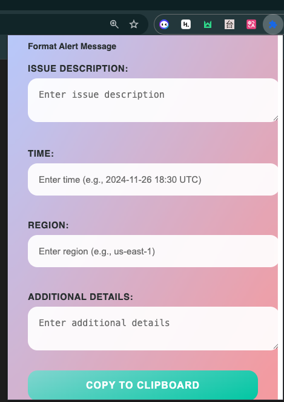

# Slack Alert Formatter - Your Quick Message Formatting Assistant

Transform plain alert messages into well-formatted Slack notifications with just one click! 

This extension helps you create professional-looking alert messages for Slack without the hassle of manual formatting.

## Key Features:
* Instant formatting of alert messages with proper Slack markdown
* One-click copy to clipboard functionality
* Supports multiple alert types (Info, Warning, Error, Success)
* Clean and intuitive interface
* Works directly from your browser

### Perfect for:
* DevOps teams sending system alerts
* Support teams sharing incident updates
* Team leads broadcasting important announcements
* Anyone who needs to quickly share formatted alerts on Slack

### How to Use:

1. Click the extension icon
2. Type or paste your message
3. Click to format and copy
4. Paste directly into Slack

**Save time and maintain consistency in your team communications with Slack Alert Formatter!**

> Note: This extension works with Google Chrome and is designed to enhance your Slack messaging experience.
# alert-formatter
